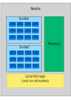
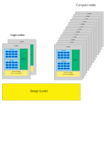

# HPC environments and modules {.title}

<small>
All material (C) 2020-2021 by CSC -IT Center for Science Ltd.
This work is licensed under a **Creative Commons Attribution-ShareAlike** 4.0
Unported License, [http://creativecommons.org/licenses/by-sa/4.0/](http://creativecommons.org/licenses/by-sa/4.0/)
</small>

# Available HPC resources

- [Puhti](https://docs.csc.fi/computing/systems-puhti/) is the general purpose supercomputer ☑️
- [Mahti](https://docs.csc.fi/computing/systems-mahti/) is the massively parallel flagship supercomputer
- [Pouta](https://docs.csc.fi/cloud/pouta/pouta-what-is/) provides cloud resources via OpenStack (Iaas)
- [Rahti](https://docs.csc.fi/cloud/rahti/rahti-what-is/) provides containers via okd (Paas)
- [Allas](https://docs.csc.fi/data/Allas/) provides object storage for all services

# Notes on vocabulary

Roughly you can think of

- computer ~= node
- processor ~= socket
- core~= CPU

{width=60%} 

# Cluster systems

- Login nodes are used to set up jobs (and to launch them)
- Jobs are run in the compute nodes
- A batch job system (aka scheduler) is used to run and manage the jobs
  - On CSC machines we use Slurm

{width=80%} 

# Quick and dirty comparison of Puhti and Mahti

|                             | Puhti  | Mahti    |
| --------------------------- |------- | ----     | 
| Number of preinstalled applications   | [123+](https://docs.csc.fi/apps/by_system/#puhti)   | [16+](https://docs.csc.fi/apps/by_system/#mahti)       | 
| Cores per node              | 40     | 128       |
| Job size (min-max) cores    | 1-1040 | 128-25600 |
| Memory per node (GiB)       | 192-1536 | 256     |
| GPU cards (NVIDIA)          | 120 x V100 | 96 x A100|
| Fast node local disk (NVMe) | 120   | (24 GPU nodes)  |

In short: Mahti is for much larger parallel jobs, prepare to install and optimize your code.
(Still, a Puhti *node* is > 10x your laptop.)

# Which supercomputer to use? 

- What kind of recources can _your application_ use?
  - Can it use more than one core?
  - How much memory it will need?
  - Can it use GPU or NVMe?
  - What takes long (is the time limiting part) in your job?
- See what kind of resources are _available_
  - Is my code already installed?
  - Max. runtime, partitions (queues), provisioning policy (Per core/per node/other)
  - Each system is different, so check the documentation

# Module systems in supercomputers

- Same information can be found in [the module section of our user guide at docs.csc.fi](https://docs.csc.fi/computing/modules/)
- Several softwares with different (possibly conflicting) requirements are needed in one supercomputer
- The solution for managing this situation: separate the applications in *modules*
- *Environment modules* set up everything required by a particular application:
   -  Load libraries, adjust path, set environment variables 

# Module system in CSC supercomputers

- Some softwares/applications have their own module (e.g. `gromacs-env`), whereas some are combined in larger modules (e.g. `biokit`, `geoconda`), and some can be found in many different modules (e.g. `gdal`)

- You can check the available applications and their respective modules in the [Application list](https://docs.csc.fi/apps/)
- These modules are used both in *interactive* and *batch jobs*

# How to use modules (1/2)

- The syntax is simple: `module command module-name`
    - For example: `module load gromacs-env`
    - [List of most common commands](https://docs.csc.fi/computing/modules/#module-commands-table)
- You can't just load all the modules because of the dependencies
- If you try to load a module that is not available, you will get an error message saying so 

# How to use modules (2/2)
 - These commands will help you figuring out the module situation:
    - `module list`: See the list of modules loaded at the moment
    - `module avail`: Modules available at the moment (due to depencies -hides modules that can't be loaded atm)
     - `module spider name`: Search for an application in the list of all existing modules
     - `module spider name/version`: Gives information on how to load the module (prerequisites etc).

# Conda environments
- [Conda](https://docs.conda.io/en/latest/) is a package management tool for distributing and installing software tools and their dependencies
- Load for example [Bioconda](https://docs.csc.fi/apps/bioconda/) or [Geoconda](https://docs.csc.fi/apps/geoconda/#using-geoconda) module to use and install tools that are already available in [Conda environments](https://docs.csc.fi/support/tutorials/conda/#what-is-conda)
   - `module load bioconda`: Load bioconda
- Use the following commands to check available Conda environments and to activate one
   - `conda env list`: List the environments
   - `source activate rseqc`: Activate Conda env with RSeQC application
  
# Customizing own environment
- If you "always" use some modules, it is possible to add loading them to `.bashrc`, but **we do not recommend this**
   - This causes the modules to be loaded always, also in batch jobs and likely will cause hard-to-spot issues later
   - If you already did this, see the [`csc-env` command FAQ](https://docs.csc.fi/support/tutorials/using_csc_env/)
- If it feels cumbersome to give the `module load this and that` at the start of each session, you can put these commands in an _alias_ in your `.bashrc`
   - _e.g._ add this line in your _.bashrc_ `alias setmyenv='module load this and that'`
   - Now, you can load all those modules simply with `setmyenv` (after logging out and back in)

# [Advanced module use](https://docs.csc.fi/computing/modules/#advanced-topics)

- You can save your current module set (`module save filename`) and load it (`module restore filename`)
- You can also write your own module files: 
    1. Add them in your home directory (`$HOME/modulefiles`) and 
    2. Add the path to the module search path (`module use $HOME/modulefiles`)
- To study existing module files: command `module show module-name` shows also the filename of the module file
