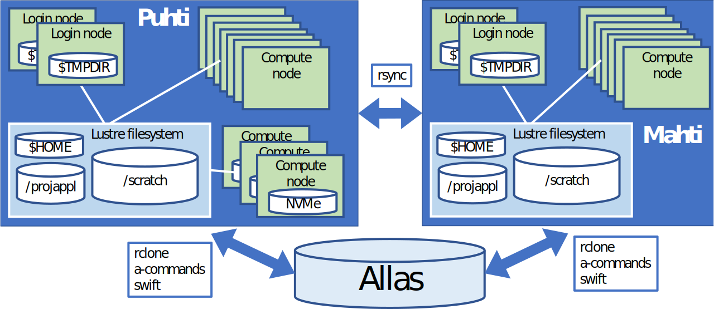
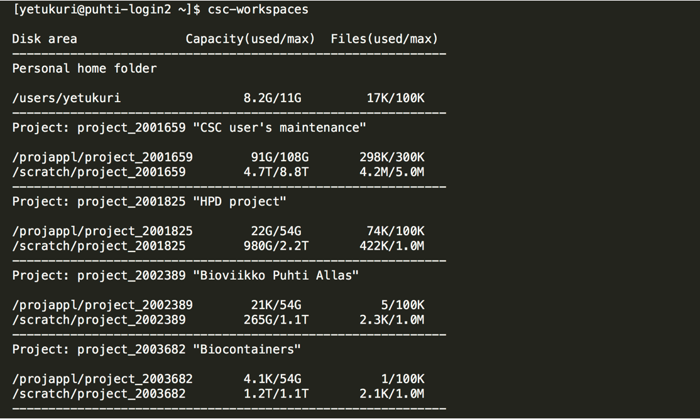
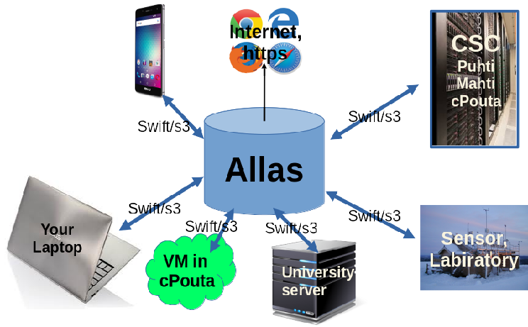

# Disk areas and Allas {.title}
In this section, you will learn how to manage different disk areas in HPC environment at CSC

<div class="column">

</div>
<div class="column">
<small>
All material (C) 2020-2021 by CSC -IT Center for Science Ltd.
This work is licensed under a **Creative Commons Attribution-ShareAlike** 4.0
Unported License, [http://creativecommons.org/licenses/by-sa/4.0/](http://creativecommons.org/licenses/by-sa/4.0/)
</small>
</div>


# Disk areas in CSC HPC environment
In this section:

- Main disk areas and their specific uses in Puhti/Mahti
- Moving data between supercomputers
- Understanding quotas (both usable space and number of files) for different disk areas
- Additional fast disk areas

# Accessing files from Puhti Web Interface

- Accessible folders: HOME, projappl and scratch
- Create (text)files and folders
- Upload/download files
- Copy/move files

# Main disk areas in Puhti/Mahti

- Home directory (`$HOME`)
    - Other users cannot access you home directory
- ProjAppl directory (`/projappl/project_name`)
    - Shared with project members
    - Possible to limit access (`chmod g-rw`) in subfolders
- Scratch directory (`/scratch/project_name`)
    - Shared with project members
    - Files older than 90 days will be automatically removed
- These directories reside on [Lustre parallel file system](https://docs.csc.fi/computing/lustre/)
- Default quotas and more info on [disk areas section](https://docs.csc.fi/computing/disk/)

# Additional fast local disk areas 

- `$TMPDIR` on Login nodes
    - Each of the login nodes have 2900 GiB of fast local storage `$TMPDIR`
    - The local storage is meant for temporary storage and is cleaned frequently
- NVMe on part of compute nodes in Puhti
    - Interactive batch job nodes, IO- and gpu-nodes have [local fast storage (NVMe)](https://docs.csc.fi/computing/running/creating-job-scripts-puhti/#local-storage) as `$LOCAL_SCRATCH`
    - You must copy data in and out during your batch job. NVMe is accessible only during your job allocation.
    - If your job reads or writes a lot of small files, using this can give 10x performance boost

# Moving data between and to/from supercomputers

- Puhti and Mahti have their own disk systems
- Data can be moved between the supercomputers 
    - directly with [rsync](https://docs.csc.fi/data/moving/rsync/) 
    - via [Allas object storage](https://docs.csc.fi/data/Allas/)
- There are [many ways to transfer data to/from CSC and your local computer](https://docs.csc.fi/data/moving/)

# Disk and storage overview  

{width=90%}

# What are the different disk areas for?

- [Allas](https://docs.csc.fi/data/Allas/) - for data which is not actively used
- [HOME](https://docs.csc.fi/computing/disk/#home-directory) - small, thus only for most important (small) files, personal access only
- [scratch](https://docs.csc.fi/computing/disk/#scratch-directory) - main working area, can be used to share with project members
- [projappl](https://docs.csc.fi/computing/disk/#projappl-directory) - not cleaned up, e.g. for shared binaries 
- [Login node local tmp](https://docs.csc.fi/computing/disk/#login-nodes) - compiling, temporary, fast IO 
- [NVMe](https://docs.csc.fi/computing/running/creating-job-scripts-puhti/#local-storage) - fast IO in batch jobs

# Displaying current status of disk areas

- use `csc-workspaces` command to display available projects and quotas 



# Some best practice tips

- Don't put databases on Lustre (projappl, scratch, home) 
    - use other CSC services like [kaivos](https://docs.csc.fi/data/kaivos/overview/) or mongoDB in cPouta
- Don't create a lot of files in one folder
- Don't create overall a lot of files (if you're creating tens of thousands of files, you should probably rethink the workflow)
- Take backups of important files. Data on CSC disks is not backed up even if systems are fault tolerant.
- When working with the large number of smaller files, consider using fast local disks
- [Best practice performance tips for using Lustre](https://docs.csc.fi/computing/lustre/#best-practices)

# Allas – object storage: what it is for?

<div class="column">
- Allas is a storage service for all computing and cloud services
- Meant for data during project lifetime
- Default quota 10 TB / Project 
- For computation the data has to be typically copied to a file system in some computer
- Data can be shared publicly to Internet, which is otherwise not easily possible at CSC.
</div>
<div class="column">
{width=90%}
</div>

# Allas – object storage: what it is NOT

- **Allas is not a file system** (even though many tools try to fool you to think so). It is just a place for a pile of static data objects.
- **Allas is not a data management environment**. Tools for etc. search, metadata,version control and access management are minimal.
- **Allas is not a foolproof back up service**. Project members can delete all the data with just one command.

# How to get access to Allas

Use [https://my.csc.fi](https://my.csc.fi) to 

1. Apply for Puhti and Allas service, quota and billing units for your project
2. Add other registered users to your project
3. Members have to register and accept the services in [https://my.csc.fi](https://my.csc.fi)

All project members have equal access to the data in Puhti and Allas.

# Allas – object storage: terminology

<div class="column">
- Storage space in Allas is provided per **CSC project**
- Project space can have multiple *buckets* ( up to 1000)
- There is only one level of hierarchy of buckets (no buckets within buckets)
- Data is stored as **objects** within a bucket
- Objects can contain any type of data (generally: object = file)
</div>
<div class="column">
- In Allas you can have 500 000 objects / bucket
- Name of the bucket must be unique within Allas
- Objects have metadata that can be enriched 
- In reality, there is no hierarcical directory structure, although it sometimes looks like that.
</div>

# Allas supports two protocols

- S3  (used by: s3cmd, rclone, a-tools)
- Swift (used by: swift, rclone, a-tools, cyberduck)  

- Authentication is different
    - S3: permanent key based authentication – nice, easy and unsecure
    - Swift: authentication based on temporary tokens – more secure, requires authentication every 8 hours
        - Metadata is handled in different ways
        - Over 5G files are managed in different ways
- **Avoid cross-using Swift and S3 based objects!**


# Allas Clients: read, write, delete

**Puhti, Mahti, Linux servers, Macs:**

- rclone, swift, s3cdm, a-tools

**Virtual machines, small servers:**

- In addition to the tools above, you can use FUSE based virtual mounts

**Laptops (Windows, Mac):**

- [Cyberduck](https://cyberduck.io/), [FileZilla(pro)](https://filezilla-project.org/), [Pouta-www interface](https://docs.csc.fi/cloud/pouta/launch-vm-from-web-gui/), [Puhti Web Interface](https://docs.csc.fi/computing/webinterface/rclone/)

# Allas – first steps for Puhti Web Interface

- After applying Allas access for your project:
- Login to Puhti in Terminal and setup connection to Allas with commands:
```bash
module load allas
allas-conf --store-token -p <project>
```
- Login to [Puhti Web Interface](puhti.csc.fi) and select RClone/Allas
- Check [the documentation](https://docs.csc.fi/computing/webinterface/rclone/)

# Allas – first steps for Puhti CLI

- After applying Allas access for your project:
- In Puhti and Mahti, setup connection to Allas with commands:
```bash
module load allas
allas-conf
```
- Study [Allas documentation](https://docs.csc.fi/data/Allas/)

# Allas – rclone

- Straight-forward power-user tool with wide range of features.
- Fast and effective.
- Available for Linux, Mac and windows.
- Overwrites and removes data without asking!
- The default configuration at CSC uses swift-protocol but S3 can be used too.
Use with care: [rclone instructions in Docs CSC](https://docs.csc.fi/#data/Allas/using_allas/rclone/)

# Allas – a-tools

- Rclone based scripts for using Allas in Puhti and Mahti
- A-tools try to provide easy and safe way to use Allas for occasional Allas user users.
- Developed for CSC server environment (Puhti, Mahti) but you can install the tools in other linux and mac machines too.
- Unlike rclone, a-tools do not overwrite and remove data without asking!
- Automatic packing and compression.
- Default bucket names based on directories of Puhti and Mahti
- [a-commands instructions in Docs CSC](https://docs.csc.fi/data/Allas/using_allas/a_commands/)

# Allas problems

- 8 hour connection limit with swift
- No way to check quota
- Moving data inside Allas is not possible (swift)
- No way to freeze data (use two projects if needed).
- Different interfaces may work in diffrent ways

# Things that users should consider 

- Should I store each file as a separate object or should I collect it into bigger chunks?
- Should I use compression?
- Who can use the data: Projects and accession permissions?
- What will happen to my data later on?
- How to keep track of all the data I have in Allas?

# Fairdata services

- [https://fairdata.fi](https://fairdata.fi) - Services to manage scientific data according to FAIR principles.
- Suitable for all static digital research material and related metadata
- Free of charge for users in Finnish higher education institutions and research institutes
- **[IDA](https://ida.fairdata.fi)** : storage for research data 
- **[Quvain](https://qvain.fairdata.fi/)** : Descibe you dataset and gent a persistent indentifier for it
- **[Etsin](https://etsin.fairdata.fi/)** : Discover datasets based on metadata

# Sensitive data services

- [CSC Sensitive Data Services](https://docs.csc.fi/data/sensitive-data/) were launched on last June. 
- **SD Desktop** [https://sd-desktop.csc.fi](https://sd-desktop.csc.fi) is a secure virtual desktop for processing data.
     - Security is based on controlled access, controlled data import, and isolation from internet.
     - Data import _only_ through **SD Connect** service. No direct data export.
- **SD Connect** [https://sd-connect.csc.fi](https://sd-connect.csc.fi) is based on Allas. 
- At the moment Allas and SD-Connect are in practice the same service.
- Allas can be used for sensitive data, _only_ if it is properly encrypted. (SD-Connect procedure does that)

