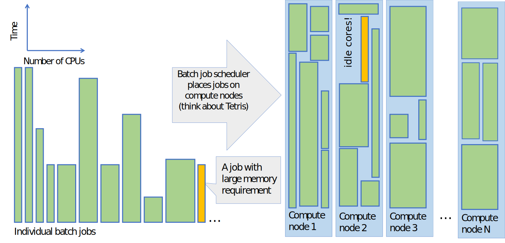

# Batch jobs and their efficient use on Puhti {.title}

<div class="column">

</div>
<div class="column">
<small>
All material (C) 2021 by CSC -IT Center for Science Ltd.
This work is licensed under a **Creative Commons Attribution-ShareAlike** 4.0
Unported License, [http://creativecommons.org/licenses/by-sa/4.0/](http://creativecommons.org/licenses/by-sa/4.0/)
</small>
</div>


# The purpose of large computers

- Typically large computers, like those at CSC, are not faster than others - they are just bigger
   - For fast computation they use parallelism (and typically have special disk and memory solutions, too)
- Parallelism simplified:
   - You use hundreds of ordinary computers simultaneously to solve a single problem
   - Puhti is a computing cluster (many interconnected computers)
- To work with clusters, we use *batch jobs*

# What is a batch job? 1/2
- On a laptop we are used to start a program (job) by clicking on an icon and the job starts instantly
- If we start many jobs at the same time, we occasionally run into problems like running out of memory _etc._
- In an HPC environment the computer is shared among hundreds of other users who all have different resource needs
- HPC batch jobs include an **estimate (requirement) on how much resources they are expected to use**

# What is a batch job? 2/2
- A batch job consists of two parts: A resource request and the actual computing step
- A job is not started directly, but is sent into a **queue**
- Depending on the requested resources and load, the job may need to wait to get started
- At CSC (and HPC systems in general) all heavy computing must be done via batch jobs (see [Usage policy](https://docs.csc.fi/computing/overview/#usage-policy))

# What is a batch job system?
- A resource management system that keeps track of all batch jobs that use, or would like to use the computing resources
- Aims to share the resources in an efficient and fair way
- Optimizes resource usage by filling the compute node with most suitable jobs

# Queueing and fair share of resources
- A job is queued and starts when the requested resources become available
- The order in which the queued jobs start depends on their priority and available resources
- At CSC the priority is configured to use "fair share"
   - The _initial_ priority of a job _decreases_ if the user has recently run lots of jobs
   - Over time (while queueing) its priority _increases_ and eventually it will run
   - Some queues have a lower priority (like _longrun_ -- use shorter if you can!)
- See our main documentation on [Getting started with running jobs](https://docs.csc.fi/computing/running/getting-started/) section in docs.csc.fi

# Schema on how the batch job scheduler works


# The batch job system in CSC's HPC environment 
- CSC uses a batch job system [(SLURM)](https://slurm.schedmd.com/sbatch.html) to manage jobs 
- SLURM is used to control how the overall computing resources are shared among all projects in an efficient and fair way
- SLURM controls how a single job request gets resources, like:
    - computing time
    - number of cores
    - amount of memory
    - other resources like gpu, local disk, *etc.*

# Example serial batch job script for Puhti

- A batch job is a shell script (bash) that consists of two parts:
   - A resource request flagged with `#SBATCH` and the actual computing step(s)

```text
#!/bin/bash
#SBATCH --job-name=print_hostname     # Defines the job name shown in the queue.
#SBATCH --time=00:01:00               # Defines the max time the job can run.
#SBATCH --partition=test              # Defines the queue in which to run the job.
#SBATCH --ntasks=1                    # Defines the number of tasks.
#SBATCH --cpus-per-task=1             # Number of cores is ntasks * cpus-per-task.
#SBATCH --account=project_20001234    # Defines the billing project. Mandatory field.

srun echo "Hello $USER! You are on node $HOSTNAME"
```
- The options have been described in [Create batch jobs for Puhti](https://docs.csc.fi/computing/running/creating-job-scripts-puhti/)
   - The actual _program_ is launched using the `srun` command
   - The content above could be copied into a file like `simple_serial.bash` and put into the queue with the command `sbatch simple_serial.bash`

# Submitting, cancelling and stats of batch jobs
- The job script file is submitted with the command:
   - `sbatch example_job.sh`
- List all your jobs that are queuing/running:
   - `squeue -u $USER`
- Detailed info of a queuing/running job:
   - `scontrol show job <jobid>`
- A job can be deleted using the command:
   - `scancel <jobid>`
- Display the used resources of a completed job:
   - `seff <jobid>`
 
# Available batch job partitions

- [The available batch job partitions](https://docs.csc.fi/computing/running/batch-job-partitions/) are listed in docs.csc.fi
- In order to use the resources in an efficient way, it is important to estimate the request as accurately as possible
- By avoiding an excessive "just-in-case" request, the job will start earlier

# Different type of HPC jobs

- Typically an HPC job can be classified as serial, parallel or GPU, depending on the main requested resource 
- The following slides will provide you with an overview of different job types
- A serial job is the simplest type of job whereas parallel and GPU jobs may require some advanced methods to fully utilise their capacity
- R jobs are typically serial or parallel (few R packages exist with GPU support)
   - We will cover R-specific topics later during the workshop

# HPC serial jobs

- Serial jobs only use one core (so don't reserve more)!
- Why could your serial job benefit from being executed using CSC's resources instead of on your own computer? 

    - Part of a larger workflow
    - Avoid data transfer between CSC and your own computer
    - Data sharing among other project members
    - Readily configured environment / dependencies (e.g. R environment on Puhti)
    - Memory and/or disk demands

# Running multiple serial jobs using job arrays
- [Job arrays](https://docs.csc.fi/computing/running/array-jobs/) can be used to simultaneously run multiple serial jobs
- Useful for so-called *embarrassingly parallel* analyses (many identical but separate tasks, e.g. repeating same steps for multiple data sets)

# HPC parallel jobs

- A parallel job distributes the calculation over several cores in order to achieve a shorter wall time (and/or a larger allocatable memory)   
- There are two major parallelization schemes: [OpenMP](https://en.wikipedia.org/wiki/OpenMP) and [MPI](https://en.wikipedia.org/wiki/Message_Passing_Interface)
   - Note, depending on the parallellization scheme there is a slight difference between _how_ the resource reservation is done  
- Batch job script [how-to create](https://docs.csc.fi/computing/running/creating-job-scripts-puhti/) and [examples](https://docs.csc.fi/computing/running/example-job-scripts-puhti/) for Puhti
- **The best starting point:** [Software specific batch scripts in docs](https://docs.csc.fi/apps/)

# Parallel resource reservation: a couple of examples

- Multicore OpenMP job

<font size="6">
```bash
#SBATCH --nodes=1
#SBATCH --ntasks=1
#SBATCH --cpus-per-task=X
```
</font>

- Multicore MPI job

<font size="6">
```bash
#SBATCH --nodes=X
#SBATCH --ntasks-per-node=Y
#SBATCH --cpus-per-task=Z
```
</font>

- `--cpus-per-task` is typically used for OpenMP jobs
- `--ntasks` is typically used for MPI jobs
    - A task cannot be split between nodes, but tasks can be on different nodes
    - `--ntasks-per-node` can be used for finer control

# HPC GPU jobs 

- A graphics processing unit (GPU, a video card), is capable of doing certain type of simultaneous calculations very efficiently
- In order to take advantage of this power, a computer program must be reprogrammed to adapt on how GPU handles data   
- CSC's GPU resources are relatively scarce and hence should be used with [particular care](https://docs.csc.fi/computing/overview/#gpu-nodes)
    - A GPU uses 60 times more billing units than a single CPU core - see above for performance requirements
    - In practice, 1-10 CPU cores (but not more) should be allocated per GPU on Puhti

# Interactive jobs

- When you login to CSC's supercomputers, you end up in one of the login nodes of the computer
    - These login nodes are shared by all users and they are [not intended for heavy computing.](https://docs.csc.fi/computing/overview/#usage-policy)
- If you have a heavier job that still requires interactive response (_e.g._ a graphical user interface)
    - Allocate the resource via the the [interactive partition](https://docs.csc.fi/computing/running/interactive-usage/)
    - This way your work is performed in a compute node, not on the login node
- We have recently launched an easy-to-use [interactive web interface for Puhti](https://docs.csc.fi/computing/webinterface/)

# Optimal usage of batch jobs on multiuser platforms

- The computing resources are shared among hundreds of your colleagues, who all have different resource needs.
- Resources allocated to your job are not available for others
   - Request only resources you need and make sure you are actually using those resources
- If you _can_ use more resources, should you?
   - There are multiple ways of parallelizing your workflow
      - Maybe several smaller jobs are better than one big?
      - Is there a more efficient code or algorithm?
      - Is the file I/O slowing you down? (lots of file operations)
   - Optimize usage considering single job wall time, overall used cpu time

# One resource type will be a bottleneck

<div class="column">
- One node can host many jobs from different users
- Different jobs need different resources
- Typically the cores run out first, but there's memory left
- Sometimes one job uses only one core, but will take up all memory
   - No further jobs are possible
   - If the job is *not* using the memory, resources are wasted
</div>
<div class="column">
{width=45%}
{width=45%}
</div>

# Slurm accounting: batch job resource usage 1/2

<div class="column">
- Resource usage can be queried with `seff SLURM_JOBID`
- Things to note:
   - low CPU Efficiency:
      - Too many cores selected?
      - Cores waiting for other processes?
      - Cores waiting for data from disk?
      - Cores spread on too many nodes? 
   - low Memory Efficiency:
      - Too much memory requested?
      - Lots of caveats here
</div>
<div class="column">
{width=90%}
</div>

# Slurm accounting: batch job resource usage 2/2

- Not all usage is captured by Slurm accounting
   - If CPU usage seems too low, look at the completion time
   - Some applications also print out timing data on log files
   - Sometimes jobs run outside `srun` don't record properly
- Job output can be tailored with `sacct`
   - `sacct -j SLURM_JOBID -o jobid,partition,state,elapsed,start,end`
   - `sacct -S 2021-08-01` would show all jobs started after that date
   - Note: these are heavy operations for Slurm. **Don't** query
     too long times, or loop these commands in scripts

# Billing units

- CPU time and storing files consume "[Billing units](https://docs.csc.fi/accounts/billing/)" (BU)
- BUs are a property of computing projects not users
- Monitor the BU usage with command `csc-projects` in the command line
   - For help/options, try `csc-projects -h`
- Batch job billing scheme:
   - Amount of resources allocated: All requested resources are billed ie. number of cores, amount of memory
   - Time allocated: Resources are billed based on the actual (wall) _time_ a job has **used**, not the reserved maximum time

# Applying for billing units

- Billing units can be also applied via [My Projects page in MyCSC](https://my.csc.fi/welcome)
   - Please [acknowledge using CSC](https://docs.csc.fi/support/faq/how-to-cite-csc/) resources in your publications
   - Please also inform us about your work by adding your publications to the resource application!
- Academic usage is one of the [free-of-use cases](https://research.csc.fi/pricing)
- You can estimate [usage with the online billing calculator](https://research.csc.fi/billing-and-monitoring#buc) 
   - The calculator can also be used to estimate the value of the resources

# Before starting large-scale calculations

- Check how the software and your actual input performs
    - Common job errors are caused by typos in the script
- Use short runs in the queue `--partition=test` to check that the input works and that the resource requests are interpreted correctly
- Check the output from the `seff` command to ensure that the cpu and memory performances are sufficient 
    - It's OK if a job is (occasionally) killed due to too small resource requests: just adjust and rerun/restart.
   - It's _worse_ to run with way too big requests (often) without knowing it!

# Reserving and optimizing batch job resources 

**Important resource requests that should be monitored with `seff` include:**

- [Memory requirement](https://docs.csc.fi/support/faq/how-much-memory-my-job-needs/)  
- [Disk workload](https://docs.csc.fi/computing/running/creating-job-scripts-puhti/#local-storage)
- [Scaling of a job over several cores and nodes](https://docs.csc.fi/computing/running/performance-checklist/#perform-a-scaling-test)
   - Parallel job must always benefit from the requested parallel resources 
   - When you double the resources the job should run 1.5x faster
   - Filling up a single node is preferrable over "thinly spread" multi-node jobs
   - Multi-node jobs carry additional overhead (i.e. at worst will slow the analysis down rather than offer a performance benefit)

# Take-home messages, pt. 1

- Try to first formulate your scientific results when you have a minimum amount of computational results
    - It often helps to clarify what you still need to compute
    - ... And what results you need to store
    - Can also help ensure the results are what you are looking for
    
- Reserving more memory / cores does not necessary mean faster computation
    - Check with `seff`, `sacct` and logs if the memory was used, and if the job ran faster
    - Testing for optimal setup regarding cores and memory is good practice before performing massive computations

# Take-home messages, pt. 2

- Running the same job on a laptop may be useful for comparison
- Avoid unnecessary reads and writes of data
    - Read and write in big chunks. 
    - Avoid writes/reads of huge numbers of small files; if this is necessary, use NVME (fast local storage)
- Don’t run jobs that are too short
    - There’s a time-overhead in setting up a batch job. Aim for at least 30 minute jobs.
- Don’t run jobs that are too long
    - The possibility of something going wrong gets bigger with risk of losing time and results

