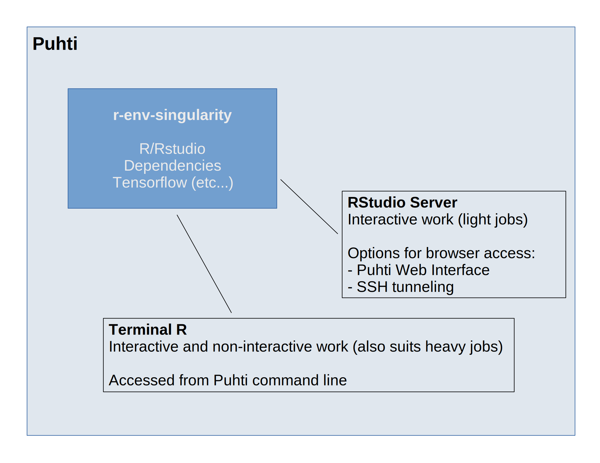
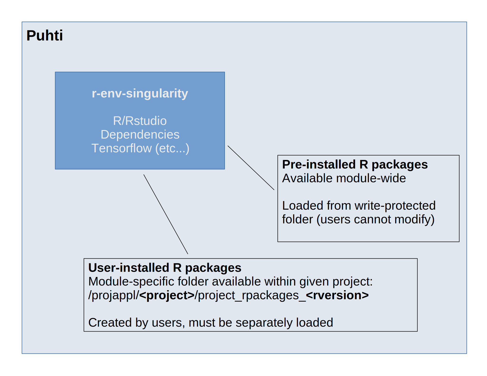

# `r-env-singularity` on Puhti {.title}

<div class="column">

</div>
<div class="column">
<small>
All material (C) 2021 by CSC -IT Center for Science Ltd.
This work is licensed under a **Creative Commons Attribution-ShareAlike** 4.0
Unported License, [http://creativecommons.org/licenses/by-sa/4.0/](http://creativecommons.org/licenses/by-sa/4.0/)
</small>
</div>

# `r-env-singularity`
- A [Singularity container](https://docs.csc.fi/computing/containers/run-existing/) including: 
   - R and RStudio Server
   - 1100+ R packages
   - Pre-installed libraries / software required by R packages
   - Software for MPI jobs (Mellanox OFED™)
   - External mathematics library linked to R (Intel® OneMKL)
   - TensorFlow (for using [the R Interface to Tensorflow](https://tensorflow.rstudio.com/))
- Detailed [module documentation](https://docs.csc.fi/apps/r-env-singularity/) available on docs.csc.fi
- Container recipes available in the CSC [singularity-recipes repository](https://github.com/CSCfi/singularity-recipes/tree/main/r-env-singularity)
- Launching + package installations differ from desktop R/RStudio

# Ways to access the container
<p align="center">
  
</p>

# RStudio Server (Puhti Web Interface)

1. Go to [www.puhti.csc.fi](https://www.puhti.csc.fi) and log in with CSC account
2. Click on Apps and choose RStudio from the drop-down menu
3. Define job details, e.g. no. of cores, memory and local disk space
4. Click on Launch and wait for the session to start

# Interactive R on the Puhti command line
1. SSH to the Puhti login node
2. Start an interactive session using the [`sinteractive` command](https://docs.csc.fi/computing/running/interactive-usage/)

For example:
```text
sinteractive -A <account> -t 00:30:00 -m 8000 -c 4

# reserves a session with a 30min duration, 8GB memory and four cores
```

3. Load `r-env-singularity` (e.g. `module load r-env-singularity/4.1.1`)
4. Launch R with the `start-r` command
5. `sinteractive` can be exited with `exit`

# Non-interactive batch jobs using R

1. SSH to the Puhti login node
2. Prepare a batch job file in the desired folder (e.g. with `nano`)
3. Submit the file with `sbatch` (e.g. `sbatch job.sh`)

- A couple of examples will follow on the next slides
- See the [`r-env-singularity` documentation](https://docs.csc.fi/apps/r-env-singularity/) for mode details

# R jobs come in many guises

- Serial
   - Single core on a single node
- Parallel
   - Multicore: many cores on one or more nodes
   - Multithread: many threads per core
   - Hybrid jobs combining elements of the above
   - Array: a way to submit many parallel jobs

# Running in parallel

- R code (like many others) is typically parallelized with MPI and/or OpenMP standards
- Both are widely used standards for writing software that run in parallel
   - MPI (Message Passing Interface) utilizes compute cores that do not share their memory (requires messaging between cores)
   - For OpenMP (Open Multi-Processing), memory is shared and does not require message passing
- Some useful self-study materials are available on the [CSC Introduction to Parallel Programming GitHub repository](https://github.com/csc-training/parallel-prog/)

***

<p align="center">
  
</p>

# Serial job

<font size="6">

```text
#!/bin/bash -l
#SBATCH --job-name=r_serial
#SBATCH --account=<project>
#SBATCH --output=output_%j.txt
#SBATCH --error=errors_%j.txt
#SBATCH --partition=test
#SBATCH --time=00:05:00
#SBATCH --ntasks=1
#SBATCH --nodes=1
#SBATCH --mem-per-cpu=1000

# Load r-env-singularity
module load r-env-singularity

# Clean up .Renviron file in home directory
if test -f ~/.Renviron; then
    sed -i '/TMPDIR/d' ~/.Renviron
fi

# Specify a temp folder path
echo "TMPDIR=/scratch/<project>" >> ~/.Renviron

# Run the R script
srun singularity_wrapper exec Rscript --no-save myscript.R
```
</font>

- Modules come with `Rscript` wrapper
    - --> `singularity_wrapper exec` is optional

# A few words on .Renviron
- .Renviron is a hidden file in the home folder
- If it does not exist (or is deleted), your next R job will spawn it
- Can be used to communicate environment variables (such as `TMPDIR`) to R
    - Another way is `export SINGULARITYENV_MYVARIABLE=x`
    - However, `export` does not work with RStudio Server
- The contents can be checked with `less ~/.Renviron`)

# Job array

- A way to run the same R script many times in parallel

<font size="6">

```text
#!/bin/bash -l
#SBATCH --job-name=r_array
#SBATCH --account=<project>
#SBATCH --output=output_%j_%a.txt
#SBATCH --error=errors_%j_%a.txt
#SBATCH --partition=small
#SBATCH --time=00:05:00
#SBATCH --array=1-10
#SBATCH --ntasks=1
#SBATCH --nodes=1
#SBATCH --mem-per-cpu=1000

# Load r-env-singularity
module load r-env-singularity

# Clean up .Renviron file in home directory
if test -f ~/.Renviron; then
    sed -i '/TMPDIR/d' ~/.Renviron
fi

# Specify a temp folder path
echo "TMPDIR=/scratch/<project>" >> ~/.Renviron

# Run the R script
srun singularity_wrapper exec Rscript --no-save myscript.R $SLURM_ARRAY_TASK_ID
```

</font>

- The key parts are `--array` and `$SLURM_ARRAY_TASK_ID`

# Multicore job

- We add `#SBATCH --cpus-per-task`, otherwise similar:

```text
#SBATCH --ntasks=1
#SBATCH --cpus-per-task=8
#SBATCH --nodes=1
#SBATCH --mem-per-cpu=1000

# --ntasks and --nodes stay 1
```

- Note that simply reserving many cores won't result in a speed-up
- One also needs to modify the R script to make use of the extra resources
    - Exact way depends on R packages / functions being used
    - Your mileage will also depend on code + packages
- `--ntasks` and `--nodes` modified only when using [MPI packages (e.g. `snow`)](https://docs.csc.fi/apps/r-env-singularity/#parallel-batch-jobs)

# How to get the number of cores in my R script?

- R offers a number of ways to detect cores
- `parallel::detectCores()` will always give 40 as result (max. on node)
- A more useful option is: 
    - `options(future.availableCores.methods = "Slurm")` followed by
    - `future::availableCores()`

- Some packages give conflicting recommendations, e.g. `rstan`: 

<font size="7">
```text
For execution on a local, multicore CPU with excess RAM we recommend calling
options(mc.cores = parallel::detectCores()).
```
</font>

- Instead would set Slurm option above and use `options(mc.cores = future::availableCores())`

# Multicore job with threading

- `--cpus-per-task` as before, while adding a few lines to the batch job file

```text
# Match thread and core numbers
export SINGULARITYENV_OMP_NUM_THREADS=$SLURM_CPUS_PER_TASK

# Thread affinity control
export SINGULARITYENV_OMP_PLACES=cores
export SINGULARITYENV_OMP_PROC_BIND=close
```

- Matching no. of threads and cores typically gives best results
- The rest is optimization (see [r-env-singularity documentation](https://docs.csc.fi/apps/r-env-singularity/))
- OpenMP x MPI jobs get quite complicated and are not covered here
    - However, [CSC Docs has an example](https://docs.csc.fi/apps/r-env-singularity/#openmp-mpi-hybrid-jobs)
    - Next slide features more general information on MPI jobs

# MPI jobs (e.g. `snow`, `doMPI`, `pbdMPI`)

- For these we use `--ntasks` (or `--ntasks-per-node`)

<font size="7">
```text
#SBATCH --ntasks-per-node=2
#SBATCH --nodes=2
```
</font>

- Other details are package-specific
    - E.g. `snow` uses one master and x slave processes (= workers)
    - In practice this means reserving one more task than the planned no. of workers
    - `snow` is also launched using `RMPISNOW` rather than `Rscript`
    - `doMPI` does not need a master task or a special launch command
- **Conclusion:** get familiar with the packages you're using, and your R code

# Combining different types of parallelism

- Array jobs can be combined with threading
- To take things even futher, these could also be combined with MPI to run several jobs in parallel
    - In this setup you’d have three layers or parallelization array-MPI-OpenMP
    - Setting this up will take skill and time
    - Always test your setup - a typo can result in a lot of lost resources

# A few words on R code optimization

- Use profiling tools to find out how much time is spent in different parts of the code
    - e.g. `profvis` package
- When the computing bottlenecks are identified, try to figure out ways to improve the code
    - servicedesk@csc.fi can also help with this

# Pre-installed vs user-installed R packages
<p align="center">
  
</p>

# How to install R packages

- Step 1: Navigate to `/projappl/<project>`
- Step 2: Create a package folder with `mkdir project_rpackages_<rversion>`
- Step 3: Add these to your R code:

```text
.libPaths(c("/projappl/<project>/project_rpackages_<rversion>", .libPaths()))
libpath <- .libPaths()[1]

# You can also use getRversion():
.libPaths(paste0("/projappl/<project>/project_rpackages_", gsub("\\.", "", getRversion()))) 
```

- Step 4: Add `libpath` to your actual R script (so your packages are found)
- Step 5: Use `lib.loc` where needed

# Using NVME (fast local storage)

<font size="6">

```text
#!/bin/bash -l
#SBATCH --job-name=r_serial_fastlocal
#SBATCH --account=<project>
#SBATCH --output=output_%j.txt
#SBATCH --error=errors_%j.txt
#SBATCH --partition=test
#SBATCH --time=00:05:00
#SBATCH --ntasks=1
#SBATCH --nodes=1
#SBATCH --mem-per-cpu=1000
#SBATCH --gres=nvme:10

# Load the module
module load r-env-singularity

# Clean up .Renviron file in home directory
if test -f ~/.Renviron; then
    sed -i '/TMPDIR/d' ~/.Renviron
fi

# Specify NVME temp folder path
echo "TMPDIR=$TMPDIR" >> ~/.Renviron

# Run the R script
srun singularity_wrapper exec Rscript --no-save myscript.R
```
</font>

- Key additions are:
    - `--gres=nvme:10` (reserves 10GB)
    - `echo "TMPDIR=$TMPDIR" >> ~/.Renviron`

# Take-home messages

- Using `r-env-singularity` has many benefits:
    - Pre-configured, transparent environment
    - Easy interactive access
    - Non-interactive jobs enable heavy computing
- Things to remember:
    - Making parallel R work as intended can take time
    - Solutions are often package- and analysis-specific
    - Typically solutions are CPU-based (rather than GPU-based)

A useful resource: [CRAN Task View for HPC](https://cran.r-project.org/web/views/HighPerformanceComputing.html)

